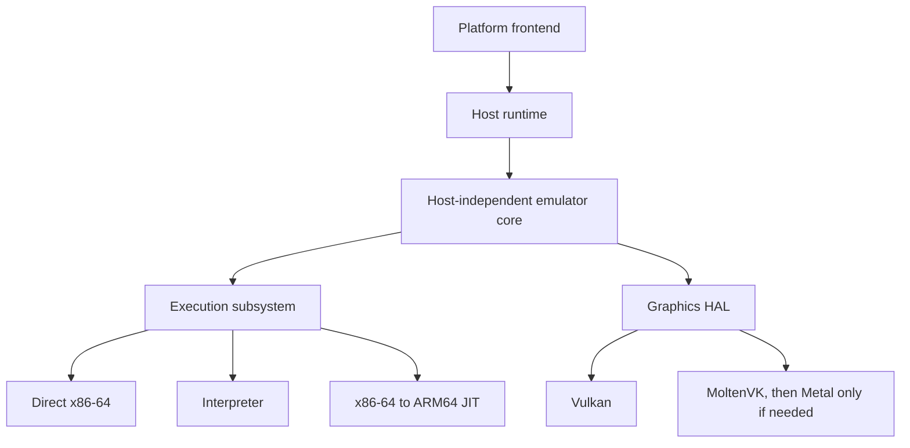

# PCSX5 Clean Rebuild Architecture

## Layers

## Boundaries

- Core owns guest state, scheduling, devices, loader semantics, and emulation contracts.
- Execution owns guest register state and the enter/resume/exit model. Native signal or exception contexts are adapters only.
- Runtime owns memory pages, fault delivery, threads, storage, timing, audio, and input capabilities.
- Graphics HAL owns API-neutral resources and commands. Backend code alone may reference Vulkan or Metal types.
- Frontends own windows, lifecycle, permissions, and user interaction. They never own emulation state.

## Target policy

| Target | Status | Gate |
|---|---|---|
| Windows x64 | Primary | Runtime contracts + Vulkan acceptance corpus |
| Linux x64 | Primary | POSIX memory/fault/runtime acceptance corpus |
| ARM64 desktop/mobile | Planned | ARM64 JIT + W^X code-cache experiments |
| macOS | Planned | Runtime experiment + MoltenVK feature matrix |
| Android | Planned | ARM64 JIT and physical-device validation |
| iOS | Experimental only | Separate JIT/distribution feasibility decision |

## Non-negotiable constraints

- No Windows types in core-facing interfaces.
- No host TEB/TLS layout assumptions in the rebuild.
- No platform-specific `#ifdef` logic in core behavior.
- No title-specific behavior in generic architecture.
- No compatibility claim without reproducible evidence.

## Phase 0 characterization boundary

On 2026-09-08 the user approved behavior-preserving extraction of legacy trap/exit code for independent testing. `src/kernel/guest_execution.*` and `src/hle/guest_lifecycle.*` remain legacy Windows implementation, never clean-core dependencies. Call sites retain the original logic; extraction does not authorize fixes for the known ABI, TLS or exit-state defects. Real lifecycle/trap paths must be exercised, not replaced by success-returning test doubles. Each new translation unit must be included by legacy consumers alongside its original caller.

The original exception handler remains in `src/kernel/kernel.cpp`. `exception_entry.h` exposes that same handler and two optional diagnostic-data providers; null providers retain original behavior. Provider changes are allowed only while execution is stopped and the handler is uninstalled. The independent [extraction review](tests/characterization/extraction-review.json) records source-body equivalence, reset scope/order and its limits; it does not certify identical binaries or the full legacy application build.

The independent project in `tests/characterization/` compiles selected legacy sources for Windows x64 tests only. It is never a dependency of the new core. `tools/characterize-windows.cmd` configures, builds and runs that project with Ninja, using an isolated output tree. Passing these tests characterizes current implementation behavior, including explicitly named defects; it does not establish PS5 hardware accuracy or portability.

Test-only link dependencies that abort if invoked may isolate unused code from a monolithic translation unit. They must have a target-specific compile guard, match declarations in original headers, and never substitute for the behavior under test. Their results cannot establish runtime, syscall-trap, or lifecycle correctness. The dispatcher fixture's injected callbacks similarly establish assembly behavior only, not the real HLE implementation.

## Subsystem migration decisions

This table consolidates the earlier checkpoint inventory without restoring deleted planning files. Dispositions are decisions, not claims that code is reusable or correct. VERIFIED: the cited source areas exist in the legacy tree; the clean root build does not depend on them.

| Legacy boundary / evidence | Disposition | Rebuild destination and gate |
|---|---|---|
| Root build, `bootstrap-windows.cmd`, legacy package scripts | Redesign build; exclude legacy packaging | Per-target CMake, Windows/Linux CI; no network dependency fetch in bootstrap |
| `src/common`, `src/common/platform`, `src/config` | Reference algorithms; redesign host/config adapters | Portable values and injected runtime services; per-file tests and provenance before reuse |
| `src/memory`, `src/kernel/memory.*` | Characterize then redesign | Owned guest regions, explicit page capabilities, checked arithmetic, normalized failures |
| `src/cpu`, `src/hle/dispatcher.asm` | Characterize then contain; no blind assembly port | Owned guest state and enter/resume/exit contract; ABI and lifecycle gates |
| `src/kernel`, `src/hle` | Reference guest semantics; redesign host boundary | Guest-owned kernel/TLS/syscall state, no native context types in core |
| `src/loader`, `src/compat`, `src/system` | Reference only until characterized | Synthetic ELF/module inputs, explicit compatibility policy; no title-specific behavior in generic core |
| `src/gpu` (renderer and shader translation) | Behavioral reference, not automatically reusable | API-neutral graphics HAL and shader model; original synthetic replays before extraction |
| `src/gpu/input`, `src/hle/audio`, `src/media` | Redesign adapters; review codecs individually | Runtime input/audio capabilities, deterministic test sources, approved dependencies only |
| `src/core_api`, `src/ipc` | Characterize and redesign | Stable frontend-facing API after headless lifecycle works |
| `src/ui`, `src/ui_csharp` | UX reference; excluded from clean core | Frontend choice deferred until headless acceptance; no WPF dependency in core |
| `src/lua`, `src/diagnostics`, `src/reports` | Reference; tools are not emulation authority | Injected diagnostics, normalized records; scripting dependency deferred |
| `tests`, `replays`, `assets`, `tools` | Review individually, no blanket import | Only reviewed synthetic fixtures in characterization; unreviewed captures/binaries/assets excluded from acceptance |
| `third_party`, optional DLLs and package declarations | Retain notices; no new-core imports approved | Exact revision, modifications, license/provenance and user approval before reuse |
| Interpreter, IR and ARM64 JIT | New implementation, not present in scaffold | Interpreter oracle before differential JIT tests; per-host code-cache experiments |

Evidence details: [dependency review](tests/characterization/dependency-review.json) and [fixture provenance](tests/characterization/fixture-provenance.json). VERIFIED in a provenance record means the specified observation or newly authored fixture origin, not legal clearance or executed-test status. Historical source authorship and unreviewed assets remain UNKNOWN. This rebuild is not certified as a legal clean-room process.

## Runtime contract decisions from characterization

Design requirements for new implementations (not descriptions of existing correctness):

- Memory reservations carry ownership, bounds, host page size, allocation granularity and allowed protections. Commit-on-fault must check registered guest ownership; unowned host faults continue to the host handler.
- Fault records carry normalized guest location, access kind and cause. Guest invalid access, breakpoint, syscall trap, demand commit and host fault are distinct outcomes. Native `CONTEXT` or signal frames remain inside runtime adapters.
- Execution owns complete modeled guest registers and a typed result (`returned`, `requested_exit`, `guest_fault`, `unsupported`). Host ABI state, stack identity and cleanup must survive every exit path exactly once. The synchronous test-only stack escape is not an implementation of that contract.
- Guest TLS identity belongs to guest-thread state. Host offsets and patched code are adapter details; emitted sequences must preserve guest flags, registers and red-zone storage according to the selected execution contract.
- Register conversion has one authoritative representation per modeled value. Any duplicate native fields must be reconciled intentionally; unsupported extended state is explicit rather than silently assumed preserved.
- Direct x64 is an execution strategy, not a substitute for isolation. A separate x64 JIT remains a measured decision. ARM64 execution is a later x86-64 translation backend, not a compiler switch.
- VERIFIED legacy failures, not acceptable contracts: switched-stack HLE exit terminates with `0xc0000028`; trap-origin in-process `SysExit` varies between `0xc0000005` and `0xc0000028`; invalid guest access terminates with `0xc0000005` in the local synthetic fixtures. A tracked guest fault can be recorded before recovery fails. Host-stack exit controls succeed. The rebuild must establish a supported exit mechanism and full host-state restoration instead of copying this longjmp/TEB strategy. The causal chain of subsequent nested faults remains UNKNOWN.
- Cleanup has explicit ownership and concurrency semantics. Legacy hook tests establish same-thread repetition/reentry and standalone `SysExit` only; concurrent cleanup and active-heartbeat teardown remain unverified. These must be tested before accepting a new execution backend.

## Trace and acceptance-corpus contract

The versioned [trace schema](tests/characterization/trace-v1.schema.json) uses contiguous sequence numbers and normalized scalar/region-relative values. Producers must remove native addresses, wall-clock times and host thread IDs. The dependency-free validator rejects invalid structure/order; it cannot recognize a raw pointer disguised as a scalar.

VERIFIED: dispatcher, selected real kernel routes and isolated/combined lifecycle producers emit **post-assertion semantic summaries** of synthetic executions. Two independent runs must validate and produce identical bytes. Fatal paths encode host restoration as unknown, never as a successful zero-filled comparison. Variable nested-diagnostic counts and in-process SysExit raw statuses remain in diagnostic output; the summary records only its checked failure to return, marking the raw status unknown. Repeatability therefore applies to this abstraction, not runtime determinism. These are not instruction traces, full architectural-state captures, a replay engine or an interpreter oracle. Those remain separate work; do not promote these summaries to accuracy references.

The minimal acceptance corpus is newly authored synthetic allocations, byte patterns, register values and test-only code. Fixtures have reviewed input origin and normalized-source hashes. Existing memory/TLS tests are usable as local legacy regression evidence, but their historical authorship is UNKNOWN. Unreviewed GPU goldens/replays, retail captures and other assets are not accepted inputs. Nothing here approves their redistribution.

## Delivery sequence and Phase 1 handoff

| Phase | Deliverable / exit gate |
|---|---|
| 0 (characterization complete) | Inventory, provenance dispositions, bounded memory/TLS/register/syscall/trap/exit matrix and evidence review; known failed invariants retained, not accepted |
| 1 | Build and boundary foundation: Windows x64 MSVC and Linux x64 GCC Debug/Release CI, headless CTest, zero-test failure, no legacy linking or release packaging |
| 2 | Narrow runtime contracts and Windows leaf implementation; contract tests without UI |
| 3 | Portable core and Linux runtime; equivalent headless tests on both hosts |
| 4 | Graphics HAL and Vulkan; isolated synthetic rendering/replay tests |
| 5 | Reference interpreter and deterministic state/trace oracle |
| 6 | Direct-x64 containment, complete exit/fault state tests; measured optional x64 JIT decision |
| 7 | ARM64 JIT; interpreter differential tests and W^X/cache experiments |
| 8 | macOS/Apple Silicon runtime plus MoltenVK acceptance |
| 9 | Android ARM64 runtime and physical-device acceptance |
| 10 | Native Metal go/no-go only after measured MoltenVK gaps |
| 11 | Product frontends, packaging and release compatibility gates |

Phase 1 task order (active; completion evidence in `REBUILD_STATUS.md`):

1. Replace the stale Windows-only legacy CI workflow with clean Windows/Linux Debug/Release jobs. Retain only approved actions, read-only permissions and test logs; no package/release job.
2. Make configure/build/test entry points work from a new worktree without local caches or network restores; wire the Codex setup script through its environment editor.
3. Enforce forbidden OS/UI/graphics includes and legacy link dependencies at the core boundary; test both positive and negative cases.
4. Add useful portable core tests beyond the current architecture-name smoke test. Require no-tests-as-error and reproducible CTest output.
5. Record real CI results before calling the build matrix verified. Runtime/platform support still requires the later acceptance gates.

### Phase 1 build/CI contract

- Four Ninja presets isolate Windows x64 MSVC and Linux x64 GCC Debug/Release outputs. Configuration is selected at configure time, not by passing multiple configurations to a single-config build.
- Each test preset fails if no tests are selected, applies a bounded default timeout, and writes CTest/JUnit logs. CI builds only the clean root; no legacy characterization, submodule restore, package creation or release publishing is part of this workflow.
- CI uses read-only repository permissions, does not persist checkout credentials, and retains only the already-used checkout, MSVC initialization and log-upload actions, pinned to verified upstream commit IDs. Runner images are version-labeled but their installed tool versions may change; logs identify the actual tools used.
- Workflow and preset validation is local evidence only. Hosted matrix success requires an actual GitHub Actions run; local GCC compilation without Linux CMake/Ninja is not Linux preset verification.

References checked for this boundary: [CMake 3.25 preset format](https://cmake.org/cmake/help/v3.25/manual/cmake-presets.7.html), [GitHub workflow syntax](https://docs.github.com/en/actions/reference/workflows-and-actions/workflow-syntax), and [hosted runner images](https://github.com/actions/runner-images).
