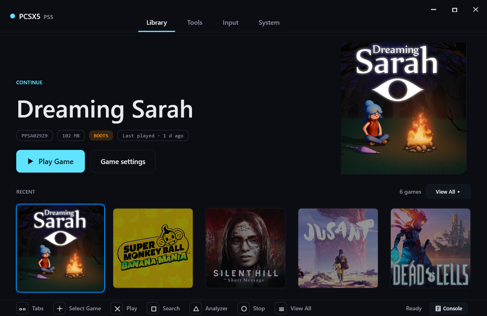
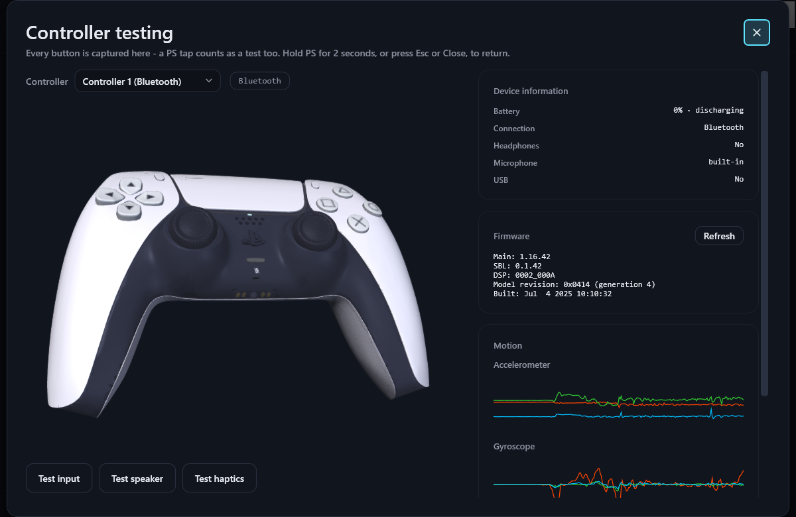
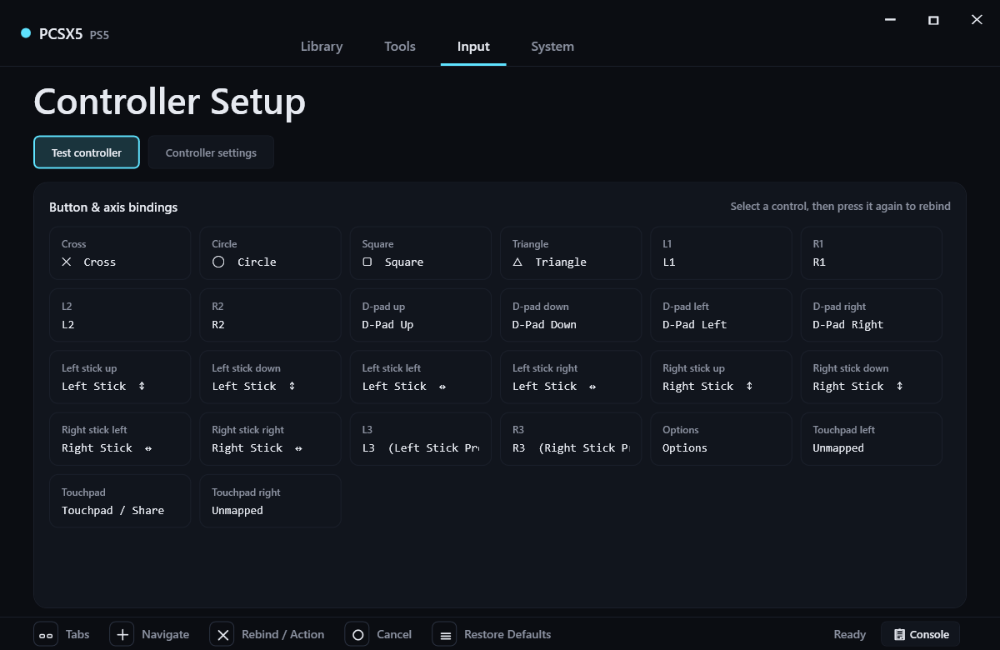
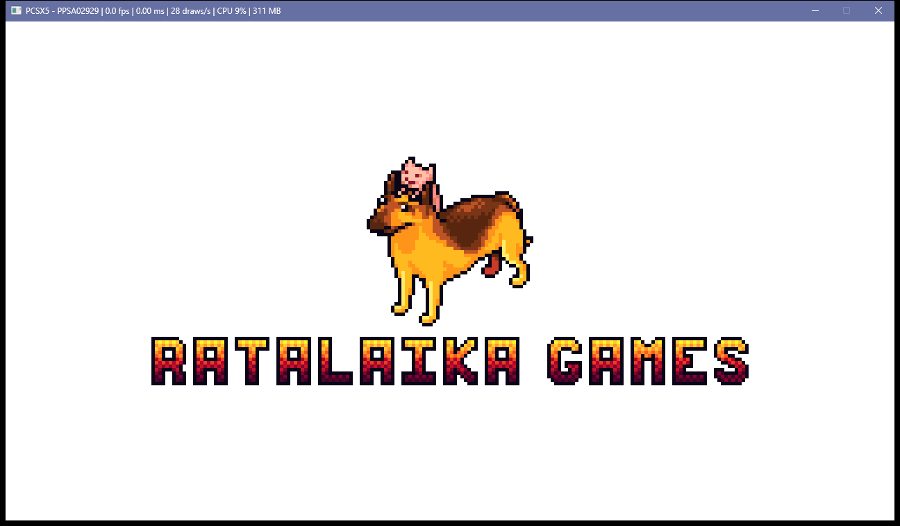
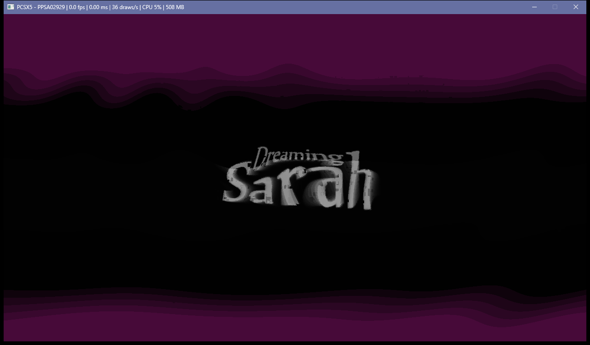

# PCSX5

[](#building)
[](#building)
[](#building)
[](#building)
[](LICENSE)

An experimental PlayStation 5 emulator for Windows x64, written in C++20 with a
Vulkan graphics backend and a .NET 9 WPF desktop shell.

---

## Important notice

PCSX5 is **not affiliated with Sony Interactive Entertainment Inc.** in any way.
"PlayStation", "PS5" and "DualSense" are trademarks of Sony Interactive
Entertainment Inc.

PCSX5 does not include, distribute or enable the download of any PlayStation
firmware, system libraries or games. You may only use software you legally own.

---

## Current status

**Early development. No game is playable.**

PCSX5 can load unmodified retail PS5 executables, run them through the boot
pipeline, spawn guest threads, translate shaders and present frames. One title,
Dreaming Sarah, now boots, renders its publisher splash and reaches an animated
title screen that keeps changing for as long as it is left running. Every other
title tested still crashes during boot, most within the first twenty seconds.

Reaching a title screen is not playability: no title has been driven into
gameplay. Expect crashes, missing rendering and no sound in most cases.

What currently works:

- SELF/ELF loading, including PS5 `PT_SCE*` segments, relocations and PIE mapping
- Dynamic module loading, import resolution and NID linking
- Guest thread creation and teardown with correct TEB/TLS handling
- A large HLE surface: libkernel, libc, libScePad, libSceAudioOut, libSceAgc,
  libSceVideoOut and others, backed by a symbol database of over a thousand
  NID-to-name mappings, each one verified by recomputing the hash rather than
  taken on trust
- GCN→SPIR-V shader translation and a Vulkan renderer, validated clean under
  the Khronos validation layers with synchronization validation enabled
- ATRAC9 audio decoding
- DualSense support over USB and Bluetooth (input, rumble, adaptive triggers,
  lightbar, player LEDs)
- A desktop shell with a game library, controller configuration, settings and a
  boot/memory analyzer

What does not work yet:

- No title runs to a playable state
- Multiple controllers — the kernel currently accepts a single pad
- DualSense speaker and microphone audio (USB-only on PC; see
  [Controller support](#controller-support))

## Compatibility

Community reports live in a separate repository:
**[PCSX5 Game Compatibility](https://github.com/Abhishekrazy/Pcsx5-Game-Compatibility)**.
If you try a title, a report there is genuinely useful — including one that does
nothing at all.

The titles below are the ones tracked in development. Their state is recorded in
[`tests/runtime_baseline.json`](tests/runtime_baseline.json), generated from real
runs rather than maintained by hand, and every run is classified by whether the
process rendered and whether the picture actually changed.

**No title is playable.** One reaches a rendered title screen; the rest crash
during boot, in different ways, which is the useful part:

| Title | ID | State | Detail |
|---|---|---|---|
| Dreaming Sarah | PPSA02929 | **Title screen** | Boots, renders the publisher splash and an animated title screen; survives 45-second runs with every sampled frame different |
| Dead Cells | PPSA15552 | Crashes | Stops after one frame |
| SILENT HILL: The Short Message | PPSA10112 | Crashes | Stops after two frames |
| Super Monkey Ball Banana Mania | PPSA01668 | Crashes | Stops after three frames |
| Poppy Playtime Chapter 1 | PPSA20591 | Crashes | Stops after six frames; on-screen content was changing |
| Jusant | PPSA10264 | Crashes | Stops after eight frames |

Every entry above was re-measured on 2026-09-07 at 30 seconds per title. Each
one still reaches a first frame at about two seconds, so they all get through
loading, module linking and GPU initialisation before failing.

## Screenshots

All of these are captures from real runs on 2026-09-07, not mock-ups.

### The desktop shell

The library, with cover art, per-game settings and a compatibility badge. The
shell runs fullscreen, is fully operable from a DualSense or the keyboard, and
switches its on-screen prompts to match whichever you last touched.



Controller setup reads a real DualSense over USB or Bluetooth. The pad is drawn
as a 3D model that mirrors the physical controller's orientation from its motion
sensors and lights up as buttons are pressed; the panels show firmware, battery
and live accelerometer and gyroscope traces.



Every button and axis is rebindable, including the touchpad zones.



### A game booting

Dreaming Sarah, running from an unmodified retail dump. The publisher splash,
rendered through the guest's own shaders and command buffers:



...and the title screen it reaches afterwards. The game applies a procedural
distortion to its logo through a three-stage post-process chain; the wobble is a
single-tap coordinate warp computed by one of its own shaders. Whether it looks
exactly like this on real hardware is unverified — there is no reference capture
to compare against.



The window title bar in these captures is the emulator's own readout: frame
rate, frame time, guest draw calls per second, host CPU and memory.

## Building

### Prerequisites

- Windows 10/11 x64
- Visual Studio 2022 or later with the C++ desktop workload
- CMake 3.20+
- .NET 9 SDK (for the WPF shell; the native core builds without it)
- Vulkan-capable GPU and drivers

### Native core and CLI

```bash
cmake -B build -S .
cmake --build build --config Release
```

Outputs:

| Artifact | Path |
|---|---|
| Emulator core | `build/bin/Release/pcsx5_core.dll` |
| Headless CLI | `build/bin/Release/pcsx5_cli.exe` |
| Boot analyzer | `build/Release/pcsx5_boot_parser.exe` |

### Desktop shell

```bash
dotnet build src/ui_csharp/Pcsx5Ui.csproj -c Release -r win-x64
```

### Tests

```bash
ctest --test-dir build -C Release --output-on-failure
```

## Running

The shell is the normal entry point. For automation and debugging, the CLI runs
a title headlessly:

```bash
build/bin/Release/pcsx5_cli.exe --headless path/to/eboot.bin
```

Useful options:

| Option | Effect |
|---|---|
| `--headless` | No window; log output only |
| `--title-id=<ID>` | Tag the session with a title ID |
| `--log-file=<path>` | Write the log to a file |
| `--log-level=<level>` | Set log verbosity |
| `--report=<path>` | Write an import/stub inventory as JSON |
| `--crash-dir=<dir>` | Where crash dumps are written |
| `--play-input=<file>` | Replay a recorded controller session |
| `--record-input=<file>` | Record a controller session |
| `--strict-imports` | Fail on unresolved imports instead of stubbing |
| `--extract-pkg <pkg> <dir>` | Extract a fake-signed PS4/PS5 PKG |

## Controller support

DualSense is supported over both USB and Bluetooth for input, rumble, adaptive
triggers, the lightbar and the player LEDs. XInput pads and the keyboard also
work, and the shell can be driven entirely from either.

The DualSense **speaker and microphone are USB-only on PC**: the controller
exposes them as a USB Audio Class device, which Windows does not enumerate when
the controller is connected over Bluetooth. Connect over USB-C to use them.

## Project layout

```
src/            emulator core — cpu, memory, kernel, hle, loader, gpu, media
src/ui_csharp/  .NET 9 WPF desktop shell
tests/          unit, integration and regression tests (CTest)
tools/          developer and reverse-engineering tooling
third_party/    vendored dependencies
architecture/   canonical architecture reference and ADRs
docs/           engineering goals and repository hygiene
guide/          component map and how to extend the emulator
wiki/           contributor how-tos (HLE symbols, syscalls, debugging, PKG)
```

## Contributing

Bug reports and pull requests are welcome. See
[CONTRIBUTING.md](CONTRIBUTING.md) and [DEVGUIDE.md](DEVGUIDE.md).

A compatibility report is far more useful with the title ID, the emulator
revision, and the log from the run.

## License

PCSX5 is released under the **GNU General Public License v2.0**. See
[LICENSE](LICENSE).

## Credits

- **[DualSense-Windows](https://github.com/Ohjurot/DualSense-Windows)** by
  Ludwig Füchsl (MIT) — DualSense HID input and output report handling. PCSX5's
  controller support is built on this work rather than re-deriving the report
  layouts. Vendored in
  [`third_party/DualSenseWindows`](third_party/DualSenseWindows).
- **[LibAtrac9](https://github.com/Thealexbarney/LibAtrac9)** by Alex Barney
  (MIT) — ATRAC9 audio decoding.
- **stb** by Sean Barrett (public domain) — image and audio decoding.
- **[Helix Toolkit](https://github.com/helix-toolkit/helix-toolkit)** (MIT) — the
  Direct3D 11 viewport that draws the 3D controller in the Input tab.
- **[Poly Haven](https://polyhaven.com/a/debris_basement_corridor)** (CC0) — the
  "Debris Basement Corridor" HDRI reflected by the 3D controller.
- **["Playstation 5 Dualsense"](https://sketchfab.com/3d-models/playstation-5-dualsense-878c1f882808477ab81c2fe86d5a3936)**
  by [AHarmlessPotato](https://sketchfab.com/AHarmlessPotato) (CC-BY-4.0) — the
  3D controller in the Input tab's testing view, split into animatable parts.
  Vendored in [`assets/gamepad/dualsense3d`](assets/gamepad/dualsense3d).
- The wider PS5 emulation and reverse-engineering community, whose public
  research made much of this possible.
