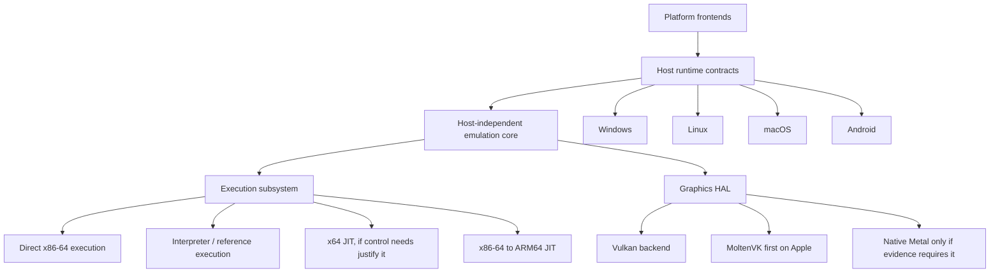

# PCSX5 Cross-Platform Clean Rebuild

**Status:** Active — Phase 0 started  
**Created:** 2026-09-08  
**Scope:** A clean-room architectural rebuild of PCSX5 for Windows, Linux, macOS, and Android, with iOS evaluated separately.

## Purpose

The current repository remains the evidence source and compatibility reference. The rebuild must not carry forward its implicit Windows and x86-64 assumptions. Source code is ported only after its behaviour is characterized by tests, traces, or documented contracts.

## Confirmed target architecture

### Corrections to the original sketch

1. PCSX5 emulates an x86-64 PS5 environment. On x86-64 hosts, direct execution is the performance baseline; a x64 JIT is optional and justified by control, isolation, or instrumentation rather than raw speed.
2. ARM64 hosts require a real x86-64-to-ARM64 recompiler. The interpreter is the differential correctness oracle and fallback, not a viable gameplay backend.
3. Vulkan is the single first renderer. On Apple, use MoltenVK before committing to a native Metal backend. The HAL still prevents that choice from becoming permanent.
4. iOS is not a committed initial target: App Store code-generation policy and JIT-entitlement constraints can make a general ARM64 JIT infeasible. Treat iOS as an explicit feasibility milestone, not an implied consequence of macOS support.

## Architectural invariants

- `core` has no OS, window, graphics-API, or frontend dependencies.
- All host services are injected through narrow contracts; platform implementations are leaf modules.
- Execution backends consume one guest-state model and one IR contract. Interpreter traces are the differential oracle for every JIT.
- Graphics emulation emits HAL work; only graphics backends know Vulkan, MoltenVK, or Metal types.
- The frontend communicates with the core through a stable public API and never reaches into subsystem internals.
- All guest code, firmware, games, keys, and proprietary assets remain user-provided and absent from the repository and releases.
- Every feature introduced for one platform has a capability declaration and a defined fallback or an explicit unsupported result.

## Delivery sequence

| Step | Deliverable | Depends on | Completion gate |
|---|---|---|---|
| 0 | Existing-system inventory and clean-room migration ledger | — | Reuse/reference/discard decisions are evidenced |
| 1 | Build, repository, CI, coding-boundary foundation | 0 | Empty targets build on Windows and Linux CI |
| 2 | Host runtime contracts and Windows implementation | 1 | Contract tests pass without emulator UI |
| 3 | Portable core extraction and Linux runtime | 2 | Headless core tests run on Windows and Linux |
| 4 | Graphics HAL and Vulkan backend extraction | 2 | Vulkan smoke/conformance suite is backend isolated |
| 5 | Reference interpreter and deterministic trace harness | 3 | Differential traces and save states are reproducible |
| 6 | x86-64 direct-execution containment and optional x64 JIT decision | 3, 5 | Direct execution is contract-contained; x64 JIT has a measured go/no-go |
| 7 | ARM64 JIT | 3, 5 | Instruction and integration differential suites pass |
| 8 | macOS / Apple Silicon via MoltenVK | 4, 7 | Headless and graphics acceptance suite pass |
| 9 | Android ARM64 and mobile shell | 4, 7 | Native Android acceptance suite passes |
| 10 | Native Metal feasibility decision | 8 | MoltenVK gaps measured; build only if required |
| 11 | Product frontends, packaging, compatibility process | 3–9 | Release artifacts and regression gates exist |

## Target support policy

| Target | Execution plan | Graphics plan | Initial commitment |
|---|---|---|---|
| Windows x64 | Direct execution, later contained behind execution interface | Vulkan | Yes |
| Linux x64 | Direct execution after runtime port | Vulkan | Yes |
| Windows/Linux ARM64 | ARM64 JIT | Vulkan | After JIT |
| macOS Intel | Direct execution where host-runtime experiments permit | MoltenVK | Secondary |
| macOS Apple Silicon | ARM64 JIT | MoltenVK, native Metal only if needed | Yes, after JIT |
| Android ARM64 | ARM64 JIT, subject to executable-memory/device validation | Vulkan | Yes, after JIT |
| iOS | Separate feasibility and distribution-policy decision | Metal/MoltenVK feasibility | Not promised |

## Risks that must be resolved by experiments

| Risk | Why it matters | Required evidence | Owner phase |
|---|---|---|---|
| Guest TLS and fault model on POSIX/macOS | Current code retargets Windows TEB state and uses VEH/SEH | Minimal isolated runtime prototypes | 3 |
| ARM64 code cache and W^X policy | JIT availability determines Apple Silicon/Android viability | Allocate/write/seal/execute prototype per target | 7 |
| MoltenVK feature coverage | Current renderer translates GCN to SPIR-V | Feature matrix plus representative replay captures | 8 |
| iOS JIT/distribution policy | May forbid the required execution model | App Store policy/legal review and prototype | 9/feasibility |
| Frontend embedding and lifecycle | A desktop shell cannot rescue an unportable core | Headless core plus platform-shell spike | 11 |

## Plan mutation protocol

- Add a decision record before replacing a major assumed boundary.
- Split a step when it cannot keep Windows green and retain a standalone verification gate.
- Do not start a platform frontend before its headless core/runtime acceptance test passes.
- Move an unproven platform to `experimental` rather than weakening the supported-platform definition.

## Phase 0

The actionable Phase 0 checklist is maintained in [phase-0-current-system-audit.md](phase-0-current-system-audit.md). Its output is a migration ledger, not a port.
