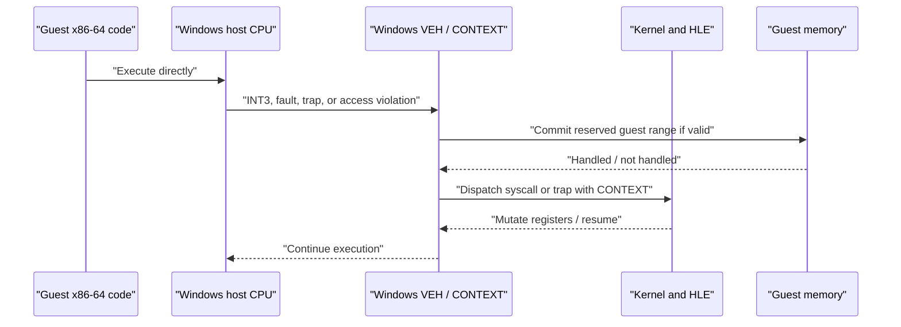

# Phase 0 — Portable Runtime Characterization Contract

**Status:** Draft from source reconnaissance — implementation deliberately deferred.  
**Scope:** The contract that the clean rebuild's host runtime and execution boundary must meet before any Linux/macOS/ARM64 port is declared viable.

## Current execution and fault path



## Observed behavior to preserve

| Contract | Current evidence | Portable requirement |
|---|---|---|
| Guest register state | `CPUState::FromContext` and `ToContext` translate Windows `CONTEXT`, including GPRs, RIP/RFLAGS, XMM0–15, and MXCSR | Define an owned `GuestRegisterState`; native signal/exception contexts only adapt at the boundary |
| Syscall dispatch | Trap handler passes `CONTEXT*`; syscall return is written into `RAX` | `DispatchSyscall(number, GuestRegisterState&)` has no native-context type in its signature |
| Guest memory | Reserve, commit, protect, query, and first-touch commit currently use Win32 virtual memory with a 64 KiB commit granularity | Page/reservation adapter explicitly reports host page size, allocation granularity, protection, region state, and errors |
| Demand commit | Reserved guest memory and physical pool faults are handled before normal crash reporting | Fault adapter may resume only for ranges registered as demand-committable; all other faults are observable and unhandled |
| Direct execution | `StartGuest` enters guest x86-64 code and control returns through Windows-specific fault/stack mechanisms | Execution backend owns enter/resume/exit; direct-x64 implementation is separate from JIT and interpreter |
| Guest stack | Current code temporarily rewrites Windows TEB `StackBase` and `StackLimit` around guest execution | Replace with an execution-stack policy that never mutates undocumented host-thread internals |
| Guest TLS | Current TLS patcher reads/stores Windows TEB TLS slots and emits x64 stubs | Guest TLS is guest-state/runtime-owned; no host TEB layout, GS offset, or Windows TLS-slot contract crosses the boundary |
| Crash diagnostics | Host crash and guest traps share `CONTEXT`-based logging | Diagnostics accept `GuestRegisterState` plus an optional normalized host-fault record |

## Required contract interfaces (design target)

```text
runtime::MemoryManager
  reserve(hint, size, options) -> Result<Reservation>
  commit(range, protection) -> Result<void>
  protect(range, protection) -> Result<void>
  query(address) -> Result<MemoryRegion>

runtime::FaultRouter
  register_guest_range(range, FaultDisposition)
  install(callback: NormalizedFault -> FaultAction)
  uninstall()

execution::GuestRegisterState
  gpr[16], rip, rflags, xmm[16], mxcsr

execution::Backend
  enter(GuestThread&, EntryPoint) -> ExecutionResult
  request_exit(GuestThread&, ExitReason)

kernel::DispatchSyscall
  (number, GuestRegisterState&, GuestThread&) -> SyscallResult
```

These are contracts, not final C++ APIs. Their critical property is isolation: no Win32 type, POSIX signal context, Vulkan type, or frontend type is allowed in the core-facing signature.

## Characterization tests to create before migration

| ID | Test | Expected invariant |
|---|---|---|
| RT-01 | Reserve/commit/protect/query lifecycle | State and protection transitions match the normalized memory model |
| RT-02 | First-touch demand commit | A registered reserved region commits exactly the configured granularity; unrelated addresses are not consumed |
| RT-03 | Guarded guest copy across pages | Copy reports partial progress or failure without host process termination |
| RT-04 | Register round-trip | Every modeled register survives native-context-to-guest-state-to-native-context conversion on x64 |
| RT-05 | Syscall register ABI | Number, argument registers, return register, and preserved registers follow the guest ABI |
| RT-06 | Guest entry/exit | Entry, explicit exit, syscall return, and fault paths restore host execution state exactly once |
| RT-07 | Guest TLS isolation | Independent guest threads observe their own TLS and do not depend on host TLS layout |
| RT-08 | Fault classification | Demand-commit, syscall trap, breakpoint, guest-invalid access, and host-invalid access produce different normalized outcomes |

## Portability gates

- Linux: prove `mmap`/`mprotect` and `sigaction` behavior against RT-01 through RT-08.
- macOS: additionally prove the guest-entry/TLS strategy without changing reserved thread-register state.
- ARM64: prove code-cache W^X allocation, instruction-cache invalidation, and register-state normalization before JIT work starts.
- Android: run the same ARM64 code-cache and signal tests on a physical device/API-level matrix.

## Current Windows baseline

Observed on 2026-09-08 using the existing `build` directory and Debug configuration:

| Existing test group | Result | Interpretation |
|---|---|---|
| `ctest -C Debug -R memory` | 5/5 passed: `memory_validation`, `memory_query`, `guest_memory_access`, `memory_write_tracker`, `kernel_memory` | The current memory behavior has an executable Windows characterization baseline |
| `tls_context` | Passed | A TLS-context test executable exists and runs |
| `syscall_validation` | Passed | Current syscall dispatch semantics have an executable baseline |
| `tls_patch_stub` | Not run: CTest registration points at a missing Debug executable | Build/test-artifact gap; rebuild this target before treating TLS patch behavior as characterized |

This result does **not** validate portability. It establishes the Windows behavior that the new contracts must preserve.

## Explicit non-goals

- No POSIX implementation is introduced by this document.
- No existing Windows fault handler, TEB rewrite, or dispatcher is altered.
- No promise is made that iOS supports the required execution model.
